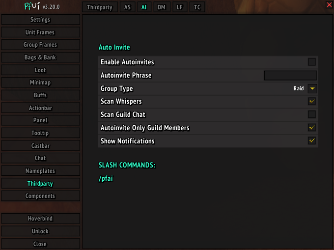

This addon is an external module for [pfUI](https://gitlab.com/shagu/pfUI) addon.

## Screenshots


## Description
Addon allows you to autoinvite people that whispers specified keyword. Additionaly it can scan guild chat for a keyword, invite only guild members and convert your group into a raid if "Group Type" option is set to "Raid"

## Installation
**This addon will not function without [pfUI](https://gitlab.com/shagu/pfUI) installed**
1. Download **[Latest Version](https://gitlab.com/dein0s_wow_vanilla/pfUI-autoinvite/-/archive/master/pfUI-master.zip)**
2. Unpack the Zip file
3. Rename the folder to "pfUI-autoinvite"
4. Copy "pfUI-managems" into Wow-Directory\Interface\AddOns
5. Restart WoW

## Commands
```
/pfai                                  - Enable/Disable autoinvites
```
